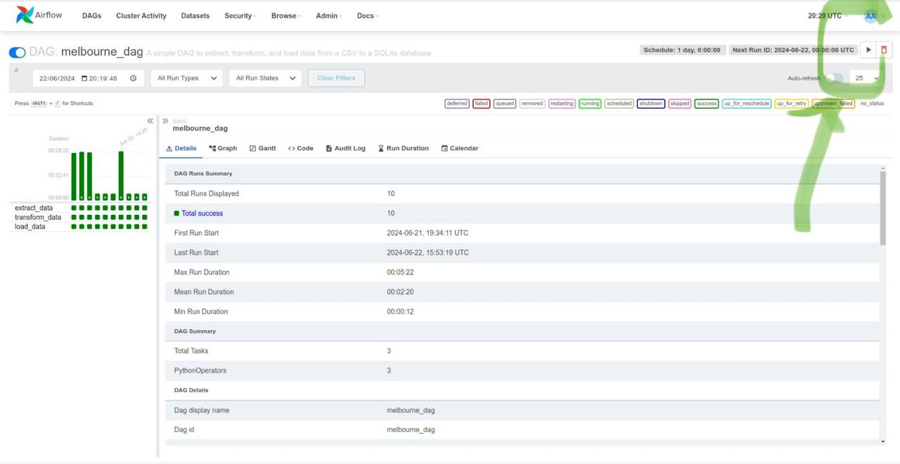

# Airflow DAG for House Price Classification

This project demonstrates using Apache Airflow to classify house prices based on predefined percentiles. The project assumes you have Docker installed and configured.
To classify the houses we classify them by **Suburb**, **Rooms**, **Type** and **YearBuilt**. And the essential colums are 
**Price**, **Suburb** and **Type**.

## Setup

1. **Clone the repository:**

   ```bash
   git clone https://github.com/diegolupi93/abstract.git
   cd abstract
   ```

2. **Create Required folders**
   
   ```bash
   mkdir config logs plugins
   ```

3. **Build and Run the Docker image:**

    ```bash
   docker-compose up
   ```

4. **Access Airflow UI:**

Open http://localhost:8080 in your browser. Use the default Airflow credentials  to login:
  ```bash
  username: airflow
  password: airflow
  ```

5. **Configure PostgreSQL connection:**

Go to Admin -> Connections in Airflow UI.
Create a new connection with the following details:
  ```bash
  Connection Id: postgres_localhost
  Host: postgres
  Database: airflow
  Login: airflow
  Password: airflow
  Port: 5432
  ```

6. **Define the config variables**
Go to Admin -> Variables in Airflow UI.
  ```bash
  Key: dag_config
  Val: 
  {
  "URL":"https://s3.amazonaws.com/external.abstractapi.com/challenges/melb_data.csv",
  "download_path":"melb_data.csv",
  "essential_fields": ["Price", "Suburb", "Type"]
  }
  ```

7. **Linux Nodification**
If you are linux user you should do
  ```bash
  sudo nano /etc/hosts
  ```
and add this line 
  ```bash
  127.0.0.1   postgres
  ```

## Running the DAG

1. **Enable the DAG:**

- Go to Airflow UI.
- Click on the toggle button to enable the melbourne_dag.

2. **Trigger the DAG:**

Once enabled, the DAG will be scheduled according to its schedule_interval.
You can manually trigger the DAG **melbourne_dag** to run immediately from the Airflow UI.



## Check the Data

To Check if the data is stored you can run the **SQLquery.ipynb**.